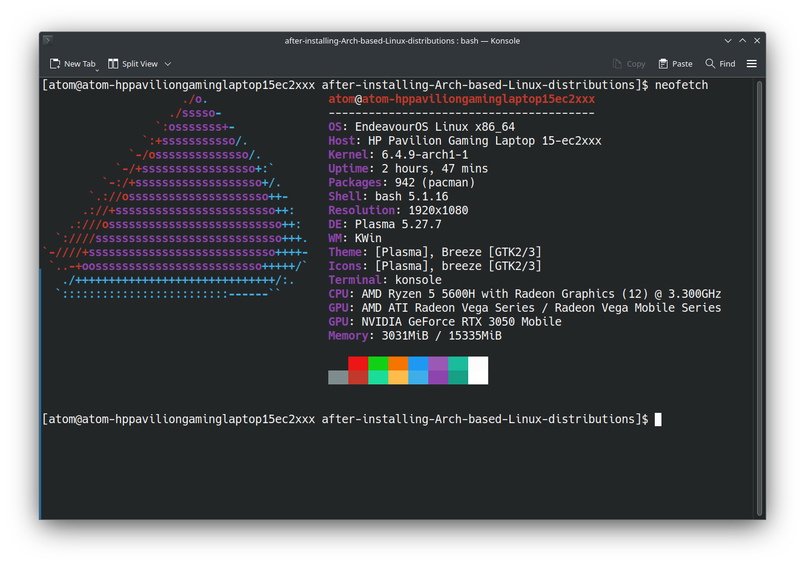

# after-installing-Arch-based-Linux-distributions


# So, this is a remake of the after-installing-Debian-based-Linux-distributions repository.
# I use 2 computers: a full workstation with an i7 860 processor on Ubuntu OS and a powerful gaming laptop with Windows 10, where I often like to install Arch-based distributions as the second system. This time, as in most of the past, it will be EndeavourOS.



# Reminder: these repositories are not meant to be 100% system setup, here I provide some commands to install a couple of programs that help me just get comfortable on Linux, most of which aren't even meant to be programmed.


# Contents:
- [Update packages](#update-packages)
- [yay](#yay)
- [Bind to change the keyboard layout to alt+shift](#bind-to-change-the-keyboard-layout-to-altshift)
- [Installing and configuring git](#installing-and-configuring-git)
- [For Python](#for-python)
- [Creating ssh key](#creating-ssh-key)
- [Google Chrome](#google-chrome)
- [PyCharm](#pycharm)
- [Visual Studio Code](#visual-studio-code)
- [Vim](#vim)
- [Installing Docker](#installing-docker)
- [Installing Docker Compose](#installing-docker-compose)
- [Installing PostgreSQL](#installing-postgresql)
- [Installing GCC](#installing-gcc)
- [Installing OBS](#installing-obs-open-broadcaster-software)
- [Installing Nvidia Drivers](#installing-nvidia-drivers)

---

## Update packages:

```bash
sudo pacman -Sy
# Update all packages including drivers:
sudo pacman -Su
```

---

## yay:

```bash
sudo pacman -S yay
```

---

## Bind to change the keyboard layout to alt+shift:

To set the Alt + Shift keyboard combination as the shortcut to switch languages in KDE Plasma on EndeavourOS or any other distribution running KDE Plasma, follow these steps:

### Open System Settings:

Click on the application launcher (usually in the bottom left corner) and then click on "System Settings". Alternatively, you can search for "System Settings" in the application launcher.
Go to Input Devices:

In the System Settings window, click on "Input Devices" under the "Hardware" section.
Keyboard Layout Settings:

Click on the "Layouts" tab.
Ensure "Configure layouts" is checked/enabled.
Here, you should see the list of keyboard layouts you've added. If you haven't added Ukrainian or any other language, you can do it here by clicking on "Add" and selecting the desired language from the list.
Switching Options:

Now, click on the "Advanced" tab.
Scroll down to find the "Switching to another layout" section.
Check the box for "Alt + Shift" or any other desired combination.
Apply the Changes:

Click the "Apply" button to save the changes.
Now, pressing Alt + Shift should switch between your keyboard layouts. If it doesn't work right away, you might want to log out and log back in or restart the Plasma shell (kwin_x11).

---

## Installing and configuring git:
```bash
sudo pacman -S git
git config --global user.name "Your_Name"
git config --global user.email "your_email@example.com"
```

---

## For Python:
```bash
sudo pacman -S python-pip
# on EndeavourOS, a virtual environment is immediately downloaded, but you can try it
sudo pacman -S python-venv
```

---

## Creating ssh key:
```bash
ssh-keygen -t rsa -b 4096 -C "your_email@example.com"
cat ~/.ssh/id_rsa.pub
```
---

## Google Chrome:
```bash
yay -S google-chrome
```

---

## PyCharm:
```bash
yay -S pycharm-community-edition
```

---

## Visual Studio Code:
```bash
sudo pacman -S code
```

---

## Vim:
```bash
sudo pacman -S vim
```

---

## Installing Docker:
```bash
sudo pacman -S docker
sudo systemctl start docker
sudo systemctl enable docker
```

---

## Installing Docker Compose:
```bash
sudo pacman -S docker-compose
```

---

## Installing PostgreSQL:
```bash
sudo pacman -S postgresql
sudo -u postgres initdb --locale $LANG -E UTF8 -D '/var/lib/postgres/data'
sudo systemctl start postgresql.service
sudo systemctl enable postgresql.service
```

---

## Installing GCC:
```bash
sudo pacman -S gcc
```

---

## Installing OBS (Open Broadcaster Software):
```bash
sudo pacman -S obs-studio
```

---

## Installing NVIDIA drivers:
```bash
sudo pacman -S nvidia nvidia-utils
```

#### If you have an optimized laptop with NVIDIA graphics (that is, if you have both an integrated GPU and a discrete NVIDIA GPU), you may also need:
```bash
sudo pacman -S nvidia-prime
```

---


 ##  Installing Spotify:
   ```bash 
   sudo snap install spotify
   ```   
   
 ---

   ## Installing Discord:  

   ```bash 
   sudo pacman -S discord
   ```

---

 ## Installing Node.Js:
   ```bash 
   pacman -S nodejs
   ```   
   
   ---

 ## Installing Postman:
   ```bash 
yay -S postman-bin
   ```  
